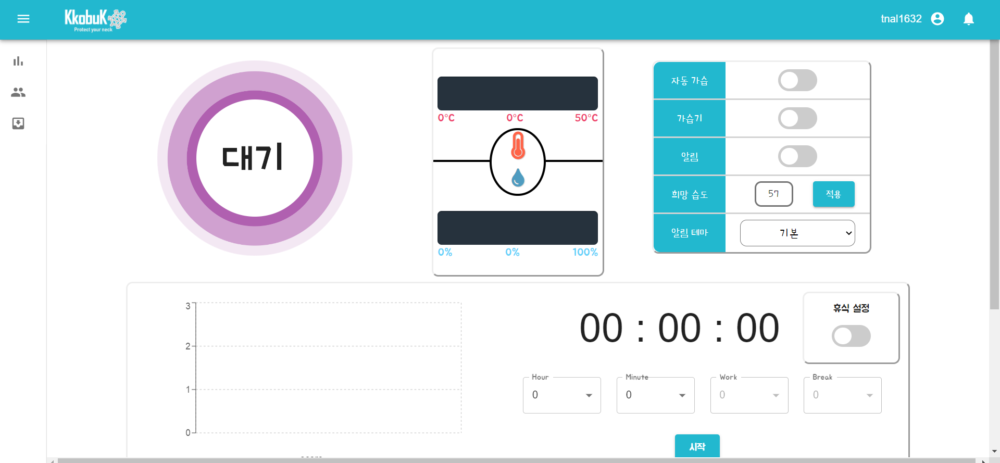
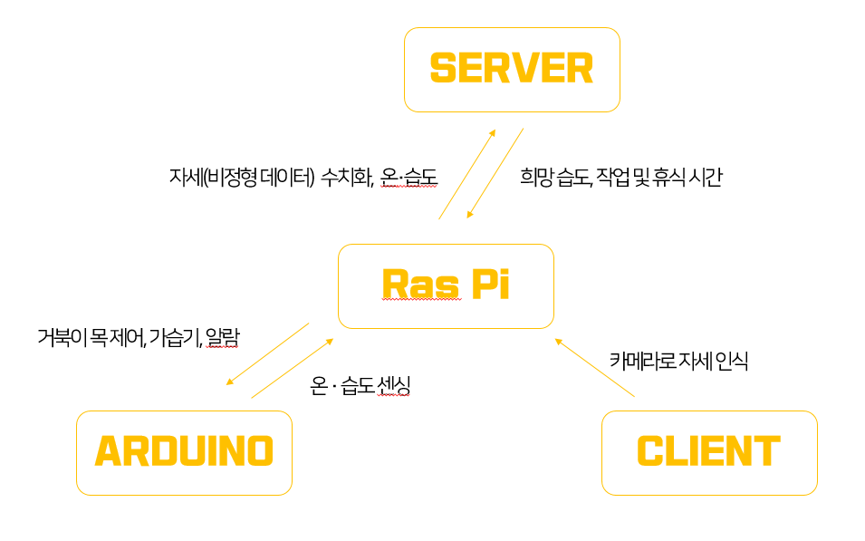

# :rocket: KkobuK
현대인들의 대표 고질병으로 꼽히는 거북목은 **자세의 나쁨을 인지하지 못한다**는 것에 있습니다.
저희 꼬북목이 여러분의 목을 지켜드릴 것입니다.


## :scream: Introduce

## Announcements

Release 1.9 사용 가능합니다.


## Deployment
```
https://i3b109.p.ssafy.io
https://kkobuk.tk
```




## Description

- IoT/
  - Django
  - Gunicorn
  - Supervisor
  - Rasberry Pi
  - Arduino
- backend/
  - Django-rest-framework
- frontend/
  - React
- Web Server
  - AWS EC2 (Ubuntu 18.04)
  - Nginx
  - Gunicorn
  - MariaDB


## Feature

**사용자에게 거북목 관리 + 최적 환경 제공** 

1. 거북목 관리
   - 사용자 모방하여 꼬북목 제어
   - 위험 자세 일정 시간 유지 시, 경고 알림
   - 웹에서 자세 점수와 통계 확인
2. 시간 관리
   - 웹에서 타이머를 이용한 작업 및 휴식 시간 설정
   - 알림 (무음, 테마)
3. 습도 관리
   - 습도 정보 확인
   - 희망 습도 설정
   - 가습기 제어


### IoT Data Flow



## Contributor

- [김호준](https://lab.ssafy.com/bright327) @bright327
- [박인남](https://lab.ssafy.com/pin954562) @pin954562
- [박주현](https://lab.ssafy.com/james5450) @james5450
- [심동식](https://lab.ssafy.com/tlaehdtlr7) @tlaehdtlr7
- [조수미](https://lab.ssafy.com/tnal1632) @tnal1632


## :lock: License

이 프로젝트의 라이센스는 챌린저 팀 소유입니다.